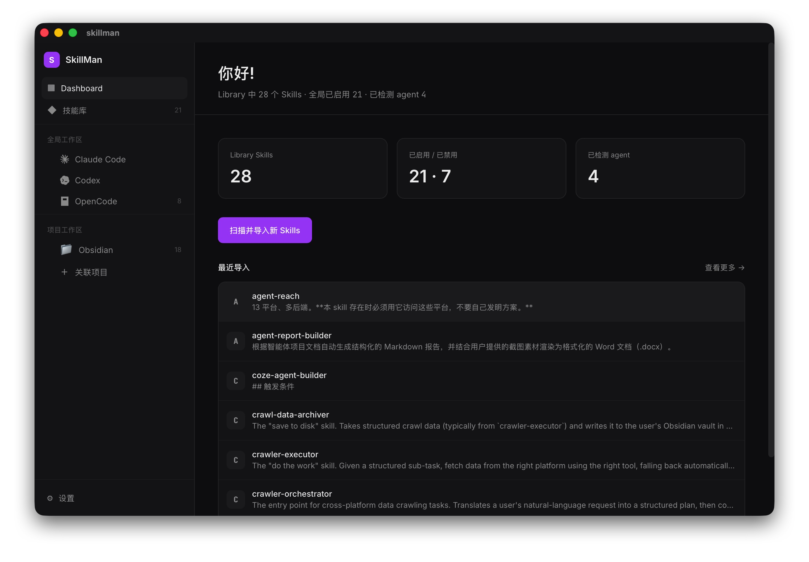
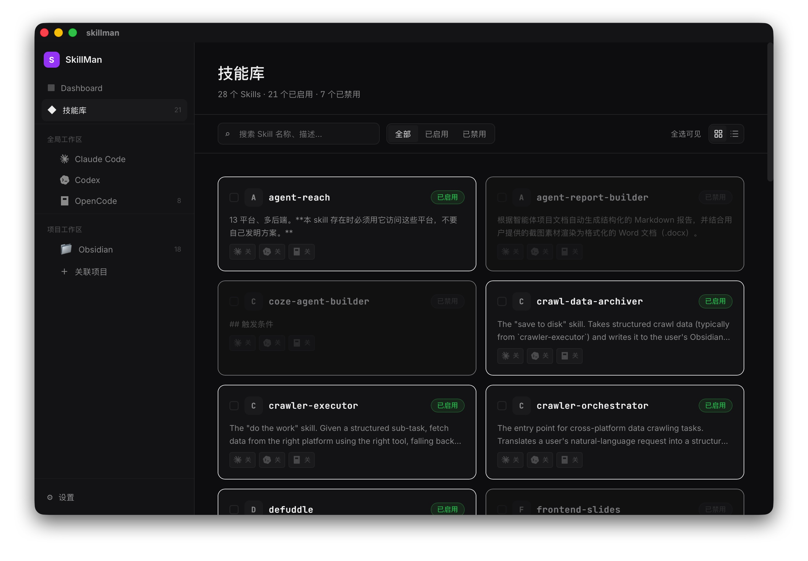
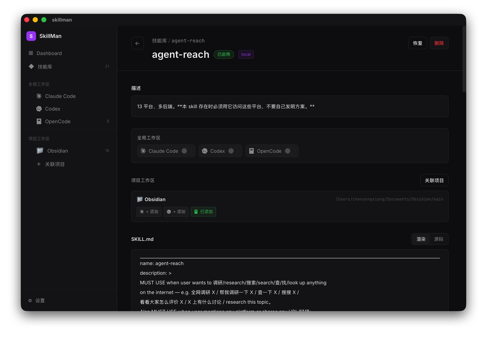
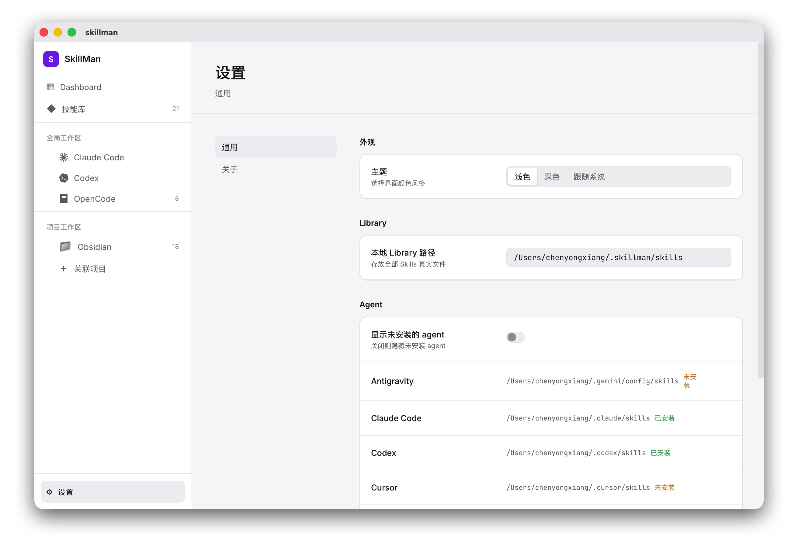

<p align="center">
  
</p>

<h1 align="center">Skillman</h1>

<p align="center">
  <strong>一处管理，多 Agent 共用——本地优先的桌面 Skill 管理器</strong>
</p>

<p align="center">
  
  
  
  
  
</p>

---

## 为什么需要 Skillman？

你在用 AI coding agent 写代码。Claude Code、Codex、OpenCode、Cursor……每个 agent 都有自己的 skills 目录，散落在磁盘各处。同一个 skill 可能在 Claude Code 和 Codex 里各有一份拷贝，改了这边忘了那边，版本混乱。

**Skillman 解决的就是这个问题。**

它把散落在各 agent 目录里的 skills 统一收进一个**单一事实源（SSOT）**，原目录替换为 symlink——所有 agent 指向同一份真实文件。改一次，处处生效。再通过 GUI 里「全局 / 项目 × 每个 Agent」两个独立维度，精细控制每个 skill 在哪个 agent 的哪个作用域里生效。

**所有数据本地存放，零联网，零遥测。** 你的 skills 永远不会离开你的电脑。

---

## 截图

| Dashboard | 技能库 |
|:---:|:---:|
|  |  |

| Skill 详情 | 设置 |
|:---:|:---:|
|  | 

---

## 如何安装

前往 **[GitHub Releases](https://github.com/RyanChen1997/skillman/releases)** 下载最新版本，根据你的系统选择对应的安装包：

| 系统 | 推荐安装包 | 说明 |
|---|---|---|
| macOS（Intel / Apple Silicon） | `skillman_*_universal.dmg` | Universal 安装包，同时支持 Intel 与 Apple Silicon |
| Windows | `skillman_*_x64-setup.exe` | NSIS 安装程序 |
| Linux（Debian / Ubuntu 等） | `skillman_*_amd64.deb` | 双击或使用 `dpkg -i` 安装 |
| Linux（其他发行版） | `skillman_*_amd64.AppImage` | 无需安装，赋予执行权限后直接运行 |

> **当前版本暂未进行代码签名/公证**，首次运行时操作系统会给出安全提示，按下方对应步骤操作即可。
>
> **macOS 用户**
> 1. 双击打开 `.dmg` 并拖动 `Skillman` 到「应用程序」。
> 2. 首次启动时若提示「无法打开 Skillman，因为无法验证开发者」，点击「好」。
> 3. 打开「系统设置 > 隐私与安全性」，在「安全性」区域找到「已阻止使用 Skillman」，点击「仍要打开」。
> 4. 再次启动 Skillman，在弹出的确认对话框中点击「打开」。
>
> **Windows 用户**
> 1. 运行下载的 `.exe` 安装程序。
> 2. 若 Microsoft Defender SmartScreen 提示「Windows 已保护你的电脑」，点击「更多信息」。
> 3. 然后点击「仍要运行」以继续安装。
>
> **Linux 用户**
> - `.deb`：双击安装或使用终端运行 `sudo dpkg -i skillman_*_amd64.deb`。
> - `.AppImage`：右键属性中勾选「允许作为程序执行」，或直接运行 `chmod +x skillman_*_amd64.AppImage && ./skillman_*_amd64.AppImage`。

---

## 核心功能

### 🔍 自动检测 + 一键导入

启动即自动检测本机已安装的 AI coding agent（Claude Code / Codex / OpenCode / Cursor / Grok / Antigravity），扫描它们的 skills 目录，展示「有哪些、各来自哪个 agent」。勾选确认后一键导入并接管。

### 📦 SSOT 单一事实源

所有被接管的 skill 真实文件只存一份，在 `~/.skillman/skills/`。原 agent 目录里的文件替换为指向 SSOT 的 symlink（Windows 无开发者模式时回退 copy）。改一处，所有 agent 同步生效。

### 🔗 双维度独立开关

`skill_links` 链接表是唯一事实源。两个维度互不冲突，可同时开启：

- **全局维度**——对某 agent 的全局 skills 目录建/删 symlink，在任何地方启动该 agent 都生效。
- **项目维度**——仅对指定项目根下的该 agent 子目录生效。

列表里直接点 agent 图标开关全局链接，无需进详情页。

### 🧩 智能去重合并

同名 skill（目录名相同）在不同 agent 目录中出现时，自动合并为一条记录 + 多来源标注。不存在重复导入或版本冲突。

### 📝 SKILL.md 预览

详情页支持 Markdown 渲染预览与源码原文两种模式，基于 `marked` 实时渲染。

### 🔄 一键恢复 / 卸载

- **恢复**：把 skill 拉回未托管状态，删除所有 symlink，SSOT 内容复制回原始的 agent 目录，从 SSOT 清理。
- **卸载**：删除所有 symlink，备份 SSOT 到 `skill-backups/`，清理数据库。

原文件在导入时已自动备份到 `~/.skillman/skill-backups/`，随时可恢复。

### 🎨 亮 / 暗双主题

纯跟随系统 `prefers-color-scheme`，自动切换。紫色 accent，紧凑排版，1px 边框，圆角 8/12px——简洁现代。

### 🔒 隐私优先

所有数据本地存储。无网络请求、无遥测、无埋点、无使用追踪。你的 skills 永远留在你的电脑上。

---

## 快速开始

### 环境要求

- **Node.js** 18+（推荐 20+）
- **pnpm**（`corepack enable` 或 `npm i -g pnpm`）
- **Rust** toolchain stable
- **macOS** / **Windows** / **Linux**

### 安装与启动

```bash
# 安装前端依赖
pnpm install

# 启动桌面应用（开发模式）
pnpm tauri dev
```

> 纯前端调试：`pnpm dev` 在浏览器中打开（Tauri 命令不可用）。

### 沙箱体验（推荐）

直接跑 app 会读写你真实的 `~/.claude/skills` 等目录。想在隔离环境里安全体验：

```bash
bash scripts/sandbox.sh                                # 建/重置沙箱
SKILLMAN_HOME=/tmp/skillman-sandbox pnpm tauri dev      # app 指向沙箱
```

沙箱会创建 4 个假 skill（含一个跨 Claude + Codex 的去重演示），完全不接触真实配置。

---

## 技术栈

| 层 | 技术 |
|---|---|
| 桌面壳 | [Tauri 2](https://tauri.app/) |
| 前端 | Vue 3 `<script setup>` + TypeScript |
| 样式 | Tailwind v4（CSS-first `@theme`） |
| 组件库 | shadcn-vue |
| 状态 / 路由 | Pinia / vue-router |
| Markdown | marked |
| 后端 | Rust + Tauri commands |
| 数据库 | SQLite（rusqlite, bundled） |
| 包管理 | pnpm |

---

## 开发

### 项目结构

```
skillman/
├── src/                     # 前端 (Vue 3 + TS)
│   ├── assets/tokens.css    # Tailwind @theme 亮/暗 token
│   ├── lib/ui/              # shadcn-vue 组件
│   ├── lib/tauri.ts         # invoke() 类型化封装
│   ├── stores/              # Pinia 状态管理
│   ├── components/          # 业务组件
│   ├── views/               # 页面视图
│   └── router/index.ts
├── src-tauri/               # Rust 后端
│   └── src/
│       ├── lib.rs           # Tauri commands 注册
│       ├── models.rs        # 数据结构
│       ├── db.rs            # SQLite + schema 迁移
│       ├── agent.rs         # Agent 检测 + 内置表
│       ├── paths.rs         # 路径管理
│       ├── services.rs      # 项目/设置 CRUD
│       └── skill/           # 核心 skill 模块
│           ├── scan.rs      # 扫描未托管
│           ├── import.rs    # 确认导入 + 接管
│           ├── sync.rs      # 链接开关 + 对账
│           ├── lifecycle.rs # 恢复 / 卸载
│           ├── fsutil.rs    # 文件操作 (symlink/copy/hash)
│           └── md.rs        # SKILL.md 解析
├── docs/                    # 需求、设计 spec、实现计划
└── scripts/sandbox.sh       # 测试沙箱脚本
```

### 验证

```bash
# 前端类型检查 + 构建
pnpm build

# Rust 单元测试
cargo test --manifest-path src-tauri/Cargo.toml
```

### 打包

```bash
pnpm tauri build
```

- **macOS**：`.app` + `.dmg`（`src-tauri/target/release/bundle/`）
- **Windows**：`.msi` / `.exe`
- **Linux**：`.deb` / `.AppImage` / `.rpm`

---

## 路径速查

| 用途 | 默认位置 |
|---|---|
| SSOT（skill 真实文件） | `~/.skillman/skills/<目录>/` |
| 数据库 | `~/.skillman/skillman.db` |
| 导入前/卸载备份 | `~/.skillman/skill-backups/` |
| Claude Code skills | `~/.claude/skills/` |
| Codex skills | `~/.codex/skills/` |
| OpenCode skills | `~/.config/opencode/skills/`（全局）· `<项目>/.opencode/skills/`（项目） |
| Cursor / Grok / Antigravity | `~/.agents/skills/`（占位，待核实） |

---

## 许可

MIT License